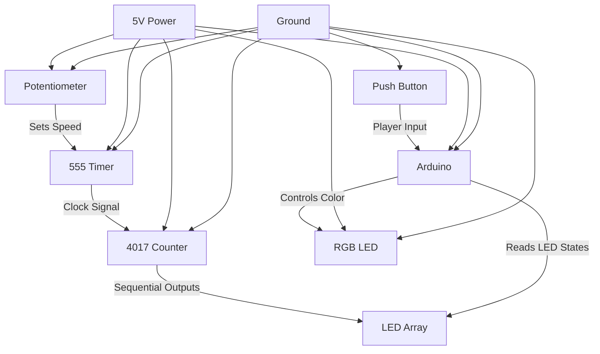
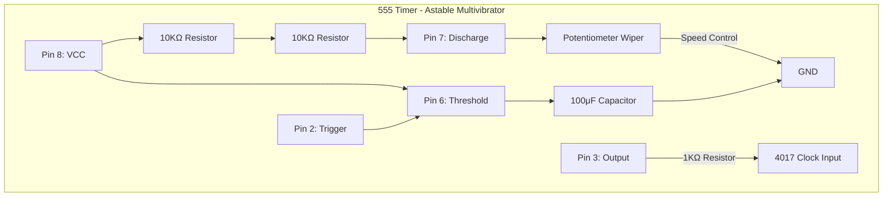
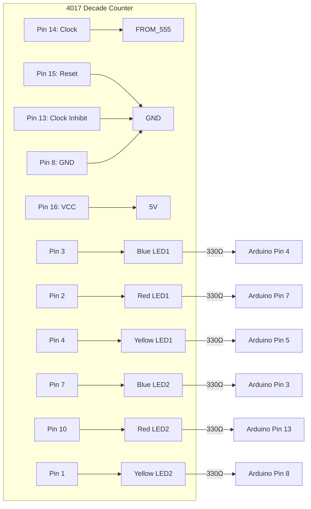
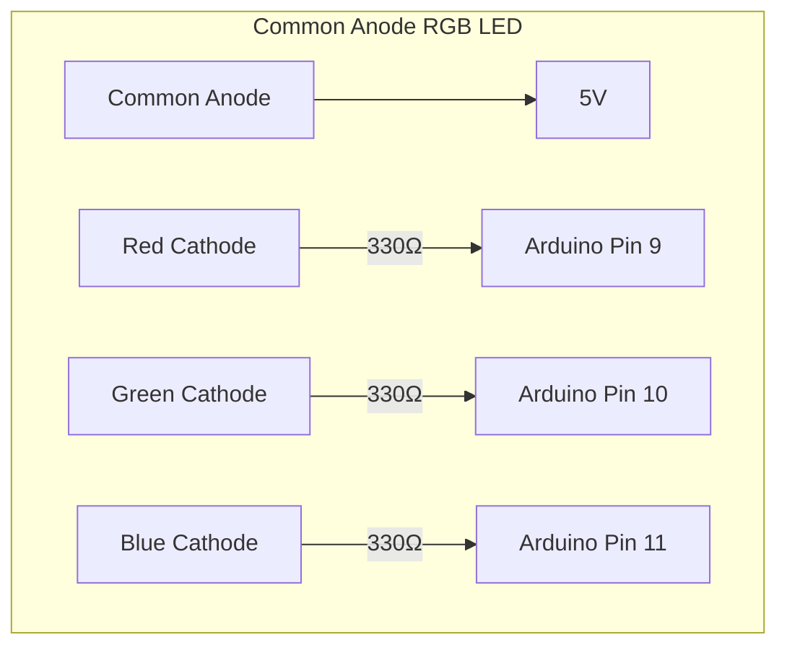
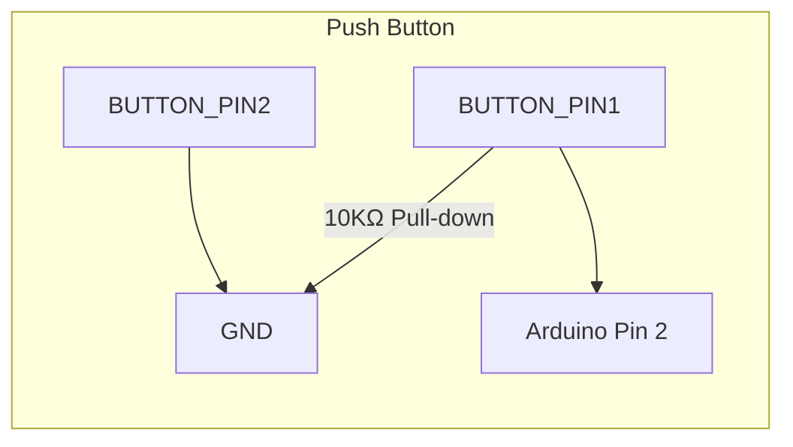
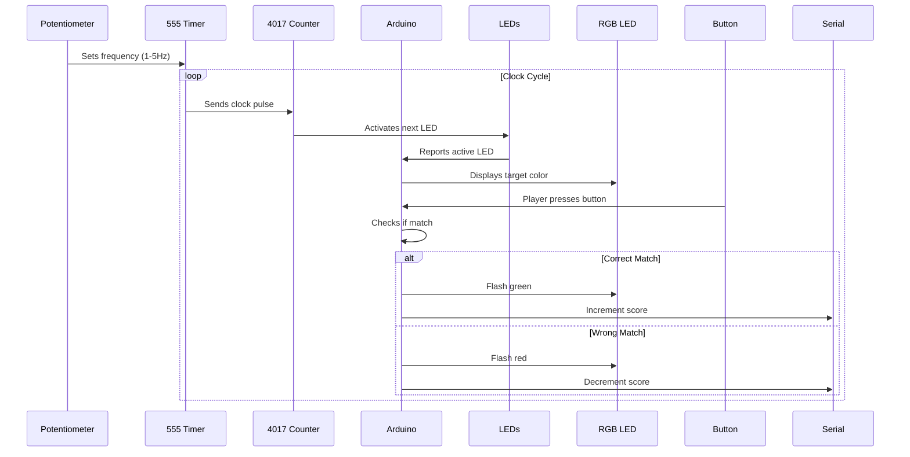

# Circuit Diagram Documentation

## Overall System Architecture

## Detailed Wiring Diagram

### 1. 555 Timer Circuit (Clock Generator)

### 2. 4017 Counter Circuit (LED Sequencer)

### 3. RGB LED Circuit

### 4. Input Circuit

## Connection Reference Table

| From Component | Pin/Connection | To Component | Pin/Connection | Wire Color | Notes |
|----------------|----------------|--------------|----------------|------------|-------|
| **Power Supply** | 5V | Breadboard | + Rail | Red | Main power line |
| **Power Supply** | GND | Breadboard | - Rail | Black | Common ground |
| **555 Timer** | Pin 1 (GND) | Breadboard | - Rail | Black | |
| **555 Timer** | Pin 8 (VCC) | Breadboard | + Rail | Red | |
| **555 Timer** | Pin 6 (THRES) | Potentiometer | Wiper | Yellow | Timing control |
| **555 Timer** | Pin 2 (TRIG) | Potentiometer | Wiper | Yellow | |
| **555 Timer** | Pin 7 (DISCH) | Resistor | 10KΩ | Orange | Timing resistor |
| **555 Timer** | Pin 3 (OUT) | Resistor | 1KΩ | Yellow | Clock signal |
| **4017 Counter** | Pin 16 (VCC) | Breadboard | + Rail | Red | |
| **4017 Counter** | Pin 8 (GND) | Breadboard | - Rail | Black | |
| **4017 Counter** | Pin 14 (CLK) | 555 Timer | Pin 3 via 1KΩ | Yellow | Clock input |
| **4017 Counter** | Pin 15 (RST) | Breadboard | - Rail | Black | Keep reset low |
| **4017 Counter** | Pin 13 (CLK INH) | Breadboard | - Rail | Black | Enable counting |
| **Potentiometer** | Pin 1 | Breadboard | + Rail | Red | |
| **Potentiometer** | Pin 3 | Breadboard | - Rail | Black | |
| **Arduino Uno** | 5V | Breadboard | + Rail | Red | Power to breadboard |
| **Arduino Uno** | GND | Breadboard | - Rail | Black | Common ground |
| **RGB LED** | Common Anode | Breadboard | + Rail | Red | |
| **Push Button** | Pin 1 | Arduino | Pin 2 | Green | Input signal |
| **Push Button** | Pin 2 | Breadboard | - Rail | Black | |

## Circuit Operation Flow

## Key Circuit Concepts

1. **555 Timer Operation**:
   - Configured in astable mode
   - Frequency formula: f = 1.44 / ((R1 + 2R2) × C)
   - Components: R1 = 1KΩ, R2 = 10KΩ (pot), C = 100μF
   - Frequency range: ~0.5-5Hz (adjustable via potentiometer)

2. **4017 Counter Logic**:
   - 5-stage Johnson counter
   - Clock pulse advances output (Q0→Q1→Q2→...→Q5→Q0)
   - Outputs stay high for one full clock cycle

3. **LED Connection Philosophy**:
   - LEDs connected between 4017 outputs and Arduino inputs
   - When 4017 output high → LED lights AND Arduino detects high
   - Resistors protect both 4017 outputs and Arduino inputs

4. **RGB LED Control**:
   - Common anode configuration
   - Cathodes connected to PWM pins for color mixing
   - Current-limiting resistors (330Ω) on each color channel

5. **Button Input**:
   - Pull-down resistor configuration
   - Prevents floating input when button not pressed
   - Clean digital signal to Arduino

## Troubleshooting Tips

1. **No LED Sequence**:
   - Check 555 output with multimeter (should pulse)
   - Verify 4017 reset (Pin 15) is grounded
   - Confirm clock signal reaches 4017 Pin 14

2. **Arduino Not Detecting LEDs**:
   - Test with multimeter (should show 5V when LED lit)
   - Verify correct pin mapping in code
   - Check for damaged resistors

3. **RGB LED Issues**:
   - Confirm common anode connected to 5V
   - Test each color channel individually
   - Ensure PWM pins are configured as outputs

4. **Button Not Responding**:
   - Verify pull-down resistor connection
   - Test continuity across button pins
   - Check Arduino pin mode (INPUT in code)

> **Safety Note**: Always disconnect power when making circuit changes. Double-check polarities before applying power.

Would you like me to provide a template for the README.md that ties all these documents together?
