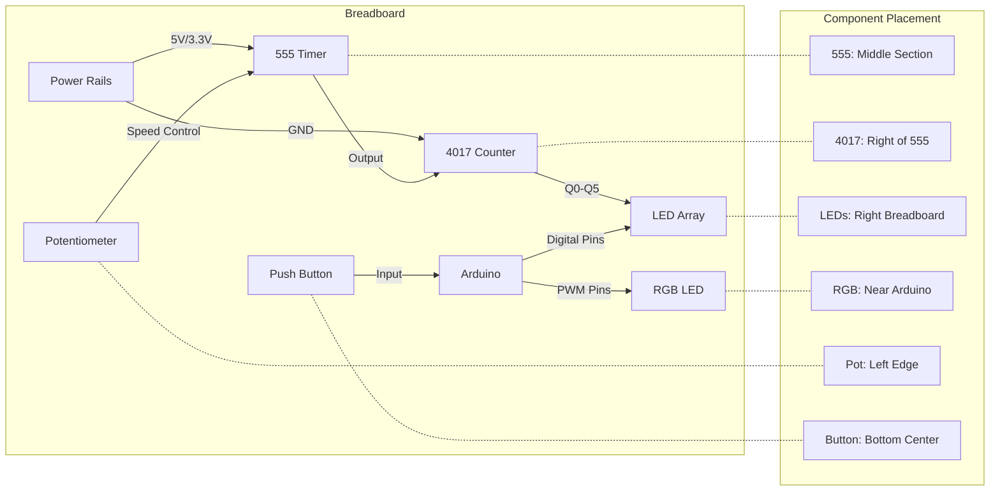
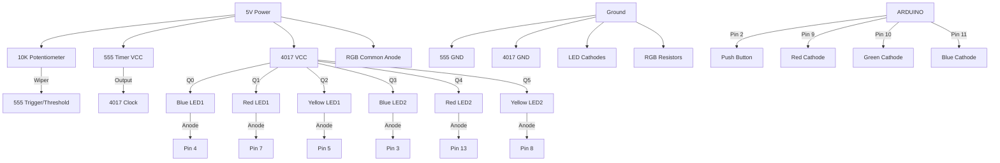

# Breadboard Layout Visualization



## Connection Diagram


## Connection Table
| Component | Pin | Connected To | Via | Notes |
|-----------|-----|-------------|-----|-------|
| **555 Timer** | | | |
| | Pin 1 (GND) | GND Rail | Wire | |
| | Pin 2 (TRIG) | Pot Wiper | Jumper | |
| | Pin 3 (OUT) | 4017 Pin 14 | 1KΩ Resistor | |
| | Pin 4 (RESET) | 5V Rail | Wire | |
| | Pin 5 (CTRL) | N/C | - | |
| | Pin 6 (THRES) | Pot Wiper | Jumper | |
| | Pin 7 (DISCH) | Pot Pin 2 | Jumper | |
| | Pin 8 (VCC) | 5V Rail | Wire | |
| **4017 Counter** | | | |
| | Pin 1 (Q5) | LED6 Anode | Jumper | Yellow |
| | Pin 2 (Q1) | LED2 Anode | Jumper | Red |
| | Pin 3 (Q0) | LED1 Anode | Jumper | Blue |
| | Pin 4 (Q2) | LED3 Anode | Jumper | Yellow |
| | Pin 5 (Q6) | N/C | - | |
| | Pin 6 (Q7) | N/C | - | |
| | Pin 7 (Q3) | LED4 Anode | Jumper | Blue |
| | Pin 8 (GND) | GND Rail | Wire | |
| | Pin 9 (Q8) | N/C | - | |
| | Pin 10 (Q4) | LED5 Anode | Jumper | Red |
| | Pin 11 (Q9) | N/C | - | |
| | Pin 12 (CO) | N/C | - | |
| | Pin 13 (CLK INH) | GND Rail | Wire | |
| | Pin 14 (CLK) | 555 Pin 3 | 1KΩ Resistor | |
| | Pin 15 (RST) | GND Rail | Wire | |
| | Pin 16 (VCC) | 5V Rail | Wire | |
| **RGB LED** | | | |
| | Common Anode | 5V Rail | Wire | |
| | Red Cathode | Arduino Pin 9 | 330Ω Resistor | |
| | Green Cathode | Arduino Pin 10 | 330Ω Resistor | |
| | Blue Cathode | Arduino Pin 11 | 330Ω Resistor | |
| **Push Button** | | | |
| | Pin 1 | Arduino Pin 2 | 10KΩ Pull-down | |
| | Pin 2 | GND Rail | Wire | |
| **Potentiometer** | | | |
| | Pin 1 | 5V Rail | Wire | |
| | Pin 2 | 555 Pins 2/6/7 | Jumper | |
| | Pin 3 | GND Rail | Wire | |

## Assembly Notes
1. **Power Distribution**:
   - Connect 5V rail to Arduino 5V output
   - Use red wires for 5V connections
   - Use black wires for GND connections

2. **Component Placement**:
   ```plaintext
   [Breadboard Layout]
   +----------------------------------+
   | POT  555  4017  LEDs  RGB       |
   |      [IC] [IC]  [][][][][][] ( )|
   | GND-----------------------GND    |
   | 5V------------------------5V     |
   | ARDUINO-------------------------|
   +----------------------------------+
   ```

3. **Critical Connections**:
   - 555 Pin 3 → 10KΩ → 4017 Pin 14
   - Each LED anode → 330Ω → Arduino input pin
   - RGB cathodes → 330Ω → Arduino PWM pins

4. **Testing Sequence**:
   1. Verify 555 output with multimeter (should pulse at 1-2Hz)
   2. Check 4017 outputs cycle through pins 3-2-4-7-10-1
   3. Test button input with serial monitor
   4. Verify RGB colors match target

> **Tip**: Use color-coded wires:
> - Red: 5V power
> - Black: GND
> - Yellow: Clock signals
> - Blue: Data lines
> - Green: Control signals
