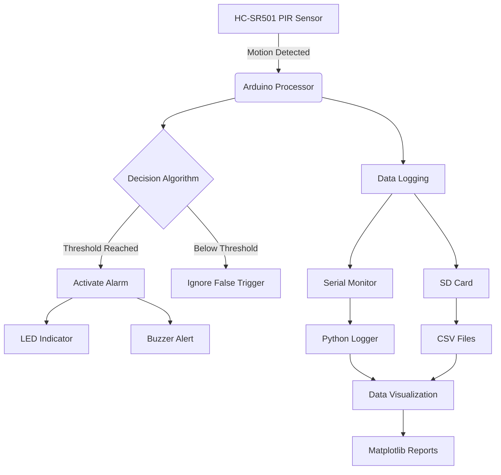
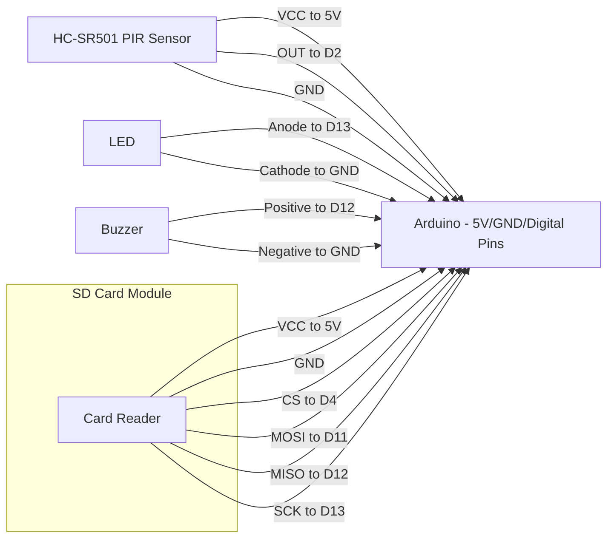

# PIR Motion Detection System


An enhanced motion detection system using HC-SR501 PIR sensor with Arduino from [Rachana Jain](https://www.instructables.com/HC-SR501-PIR-Sensor-With-Arduino/) featuring:
- Multi-output alerts (LED + Buzzer)
- Serial & SD card data logging
- False trigger prevention
- Data visualization tools
- Comprehensive troubleshooting



## Features Overview
- **Smart Detection Logic**: 
  ```mermaid
  graph LR
      A[Motion Signal] --> B{Sensitivity Check}
      B -->|>3 Triggers| C[Activate Alarm]
      B -->|<3 Triggers| D[Ignore]
  ```
- **Multi-channel Outputs**: Visual (LED) + Audible (Buzzer) alerts
- **Advanced Data Logging**:
  - Real-time serial monitoring
  - SD card storage (CSV format)
  - Python data collector
- **Professional Visualization**:
  - Motion timeline charts
  - Activity heatmaps
  - Statistical reports
- **Robust Troubleshooting**: Solutions for common sensor issues

## Hardware Requirements
| Component | Quantity | Notes |
|-----------|----------|-------|
| Arduino Uno | 1 | Nano or Mega also work |
| HC-SR501 PIR Sensor | 1 | Adjustable sensitivity |
| Active Buzzer | 1 | 5V operating voltage |
| LED | 1 | Any color |
| 220Ω Resistor | 1 | For LED protection |
| SD Card Module | 1 | Optional for data logging |
| Breadboard & Jumper Wires | As needed | - |

## Wiring Diagram


## Installation & Setup
1. **Hardware Assembly**:
   ```bash
   # Follow wiring diagram
   PIR VCC → 5V
   PIR OUT → Digital Pin 2
   PIR GND → GND
   LED+ → D13 → Resistor → GND
   Buzzer+ → D12 → GND
   ```

2. **Software Setup**:
   ```bash
   git clone https://github.com/Customize5773/PIR-Sensor.git
   Open PIR_Sensor.ino or Advance_PIR_Sensor.ino in Arduino IDE
   Install required libraries (if any)
   Upload to Arduino board
   ```

3. **Calibration**:
   - Allow 60 seconds for PIR sensor warm-up
   - Adjust sensitivity potentiometer (clockwise to increase)
   - Set jumper to "H" (Repeatable Trigger) mode

## Usage Examples
### Basic Operation
```cpp
void loop() {
  if (detectMotion() && !falseTrigger()) {
    activateAlarm();
    logEvent("ALARM ACTIVATED");
  }
}
```

### Data Logging
```python
# Run Python logger:
python extras/Python_Serial_Logger.py

# Sample output:
2023-07-01T12:30:45.123, ALARM ACTIVATED, MOTION, ON
```

## Data Analysis


Generate reports with:
```bash
python extras/Data_Analysis_Example/motion_analysis.py motion_log.csv
```

## Troubleshooting Guide
| Issue | Solution |
|-------|----------|
| False Triggers | 1. Adjust sensitivity pot<br>2. Avoid air currents<br>3. Increase code threshold |
| No Detection | 1. Check 60s warm-up<br>2. Verify jumper in "H" position<br>3. Test at 1-6m distance |
| Buzzer Not Working | 1. Confirm active buzzer type<br>2. Check polarity<br>3. Test with direct 5V |
| SD Card Errors | 1. Format as FAT32<br>2. Check wiring<br>3. Verify chip select pin |

## Project Extensions
1. **IoT Integration**:
   ```mermaid
   graph LR
       A[Arduino] --> B[ESP8266]
       B --> C[Cloud Service]
       C --> D[Mobile Alert]
   ```
2. **Advanced Security**:
   - Camera trigger integration
   - Telegram/Email notifications
   - Access control system
3. **Environmental Correlation**:
   - Temperature/humidity sensors
   - Motion vs weather analysis
4. **Energy Saving Mode**:
   - Sleep/wake cycles
   - Battery optimization
---

**Contributors Welcome!**  
Found a bug or have an enhancement? Open an issue or submit a PR!
