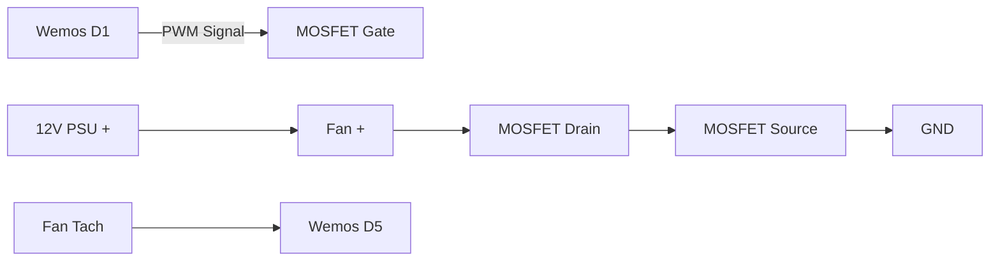

# 25kHz PWM Implementation Guide

## Why 25kHz?
1. **Human Hearing Range**: Above 20kHz is inaudible
2. **Fan Specifications**: PC fans expect 21-28kHz PWM
3. **Electrical Noise**: Higher frequencies reduce EMI
4. **Smoother Control**: Eliminates motor "clicking" sounds

## Hardware Requirements
1. **Wemos D1 Mini** - GPIO5 (D1) supports 25kHz output
2. **MOSFET Selection**:
   - Must be logic-level (Vgs < 3.3V)
   - Recommended: IRLB8721, IRLZ44N, IRL540
   - Avoid: TIP120 (Darlington - insufficient gain)
3. **Gate Protection**:
   - 100-220Ω resistor in series with gate
   - 10kΩ pull-down resistor (GND to gate)

## Circuit Design


## Code Implementation
### 1. Frequency Setup (Required)
```cpp
// In setup()
analogWriteFreq(25000);  // Set 25kHz PWM frequency
```

### 2. Duty Cycle Control
```cpp
void setFanSpeed(uint8_t percent) {
  uint32_t duty = map(percent, 0, 100, 0, 1023);
  analogWrite(FAN_PWM_PIN, duty);  // 10-bit resolution
}
```

### 3. Critical Timing Parameters
| **Parameter**        | **Value**  | **Notes**                           |
|----------------------|------------|-------------------------------------|
| PWM Frequency        | 25,000 Hz  | ±10% acceptable                    |
| Resolution           | 10-bit     | 1024 steps (0-1023)                |
| Minimum Pulse Width  | 1μs        | 2.5% duty cycle at 25kHz           |
| Rise/Fall Time       | <100ns     | Requires MOSFET with low Qg        |

## Validation Methods

### 1. Oscilloscope Test
1. Connect probe to PWM wire
2. Verify:
   - Frequency: 25.0 ± 2.5kHz
   - Duty cycle matches code setting
   - Clean square wave (no ringing)

### 2. Acoustic Validation
1. Set fan to 30% speed
2. Listen for:
   - High-pitched whine → frequency too low
   - Clicking sounds → frequency < 1kHz
   - Silent operation → correct 25kHz

### 3. Multimeter Check
1. Set to frequency mode
2. Measure between PWM wire and GND
3. Acceptable range: 22.5-27.5kHz

## Troubleshooting PWM Issues

| **Symptom**                  | **Likely Cause**              | **Fix**                          |
|------------------------------|-------------------------------|----------------------------------|
| Fan runs at 100% constantly  | MOSFET gate not connected     | Check D1 pin connection         |
| Fan doesn't start            | Vgs too low                   | Use logic-level MOSFET          |
| PWM jitter/instability       | ESP8266 Wi-Fi interference    | Add `WiFi.forceSleepBegin()`    |
| Inconsistent speed control   | Insufficient PWM resolution   | Use 10-bit mapping (0-1023)     |
| MOSFET overheating           | Slow switching speed          | Add gate driver (TC4427)        |

## Advanced Configuration

### 1. Phase-Correct PWM (Smoother)
```cpp
// Not directly supported in ESP8266 Arduino core
// Requires register-level programming:
#define PWM_PIN 5  // GPIO5
const uint32_t pwmRange = 1023;

void setup25kHzPWM() {
  pinMode(PWM_PIN, OUTPUT);
  uint32_t clock = 1000000;  // 1MHz base clock
  uint32_t divider = 1;
  analogWriteRange(pwmRange);
  analogWriteFreq(25000);
}
```

### 2. Multiple Fans Synchronization
```cpp
// Set identical frequency for all PWM pins
const uint8_t fanPins[] = {D1, D2, D8};

void setup() {
  for(auto pin : fanPins) {
    pinMode(pin, OUTPUT);
    analogWriteFreq(25000);
    analogWrite(pin, 0);
  }
}
```

## Safety Considerations
1. **Flyback Protection**: Always include diode across fan terminals
2. **Current Limiting**: Max 0.5A per GPIO pin
3. **Heat Management**: MOSFETs need heatsink above 1A load
4. **Isolation**: Keep 12V and 3.3V grounds connected at single point

> **Pro Tip**: For industrial applications, use optoisolated PWM drivers
